# AnimatedBottomBar
[](https://opensource.org/licenses/MIT)
[](https://android-arsenal.com/api?level=16) 
[ ](https://bintray.com/droppers/AnimatedBottomBar/nl.joery.animatedbottombar/_latestVersion)


A customizable and easy to use bottom bar view with sleek animations.

## Examples

<br>

<br>
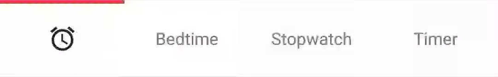
<br>
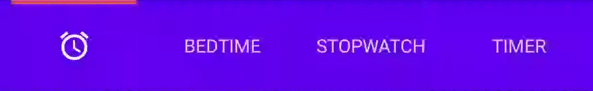

### Demo app
Download the app showcasing the examples: [demo.apk](./media/demo.apk)

## Contents
- [Getting started](#getting-started)
- [Managing tabs](#managing-tabs)
- [Configuration](#configuration)

## Getting started


Add the following dependency to your <b>build.gradle</b>:

```gradle
implementation 'nl.joery.animatedbottombar:library:1.0.1'
```

Define `AnimatedBottomBar` in your XML layout with custom attributes.
```xml
<nl.joery.animatedbottombar.AnimatedBottomBar
    android:id="@+id/bottom_bar"
    android:background="#FFF"
    android:layout_width="match_parent"
    android:layout_height="wrap_content"
    app:abb_selectedTabType="text"
    app:abb_indicatorAppearance="round"
    app:abb_indicatorMargin="16dp"
    app:abb_indicatorHeight="4dp"
    app:abb_tabs="@menu/tabs"
    app:abb_selectedIndex="1" />
```

Create a file named `tabs.xml` in the `res/menu/` resources folder:
```xml
<menu xmlns:android="http://schemas.android.com/apk/res/android">
    <item
        android:id="@+id/tab_home"
        android:icon="@drawable/home"
        android:title="@string/home" />
    <item
        android:id="@+id/tab_alarm"
        android:icon="@drawable/alarm"
        android:title="@string/alarm" />
    <item
        android:id="@+id/tab_bread"
        android:icon="@drawable/bread"
        android:title="@string/bread" />
    <item
        android:id="@+id/tab_cart"
        android:icon="@drawable/cart"
        android:title="@string/cart" />
</menu>
```

Get notified when the selected tab changes:
```java
bottom_bar.setOnTabSelectListener(object : AnimatedBottomBar.OnTabSelectListener {
    override fun onTabSelected(
        lastIndex: Int,
        lastTab: AnimatedBottomBar.Tab?,
        newIndex: Int,
        newTab: AnimatedBottomBar.Tab
    ) {
        Log.d("TAB_SELECTED", "Selected index: $newIndex, title: ${newTab.title}")
    }
})
```

## Managing tabs
Short overview on how to manage tabs using code.

### Creating new tabs
```kotlin
// Creating a tab by passing values
val bottomBarTab1 = AnimatedBottomBar.createTab(drawable, "Tab 1")

// Creating a tab by passing Resource IDs
val bottomBarTab2 = AnimatedBottomBar.createTab(R.drawable.ic_home, R.string.tab_2)
```
### Adding new tabs
```kotlin 
// Adding a tab at the end
AnimatedBottomBar.addTab(bottomBarTab1)

// Add a tab at a specific position
AnimatedBottomBar.addTabAt(1, bottomBarTab2)
```

### Removing tabs
```kotlin
// Removing a tab by object reference
val tabToRemove = AnimatedBottomBar.tabs[1]
AnimatedBottomBar.removeTab(tabToRemove)

// Removing a tab at a specific position
AnimatedBottomBar.removeTabAt(tabPosition)
```

### Selecting tabs
```kotlin
// Selecting a tab by object reference
val tabToSelect = AnimatedBottomBar.tabs[1]
AnimatedBottomBar.selectTab(tabToSelect)

// Selecting a tab at a specific position
AnimatedBottomBar.selectTabAt(1)
```

### Intercepting tabs
Could be useful for example restricting access to a premium area.

```kotlin
bottom_bar.setOnTabInterceptListener(object : AnimatedBottomBar.OnTabInterceptListener {
    override fun onTabIntercepted(
        lastIndex: Int,
        lastTab: AnimatedBottomBar.Tab?,
        newIndex: Int,
        newTab: AnimatedBottomBar.Tab
    ): Boolean {
        if (newTab.id == R.id.tab_pro_feature && !hasProVersion) {
            // e.g. show a dialog
            return true;
        }
        return false
    }
})
```

## Configuration
An overview of all configuration options. All options can also be accessed and set programmatically, by their equivalent name.

### Tabs
<table>
    <tr>
        <th>Attribute</th>
        <th>Description</th>
        <th>Default</th>
    </tr>
    <tr>
        <td><b>abb_tabs</b></td>
        <td>Tabs can be defined in a menu file (<a href="https://developer.android.com/guide/topics/resources/menu-resource">Menu resource</a>), in the <i>res/menu/</i> resource folder.<br><br>The <b>icon</b> and <b>title</b> attribute are required. 
<pre lang="xml">
&#x3C;menu xmlns:android=&#x22;http://schemas.android.com/apk/res/android&#x22;&#x3E;
    &#x3C;item
        android:id=&#x22;@+id/tab_example&#x22;
        android:icon=&#x22;@drawable/ic_example&#x22;
        android:title=&#x22;@string/tab_example&#x22; /&#x3E;
    ...etc
&#x3C;/menu&#x3E;
</pre></td>
        <td></td>
    </tr>
    <tr>
        <td><b>abb_selectedIndex</b></td>
        <td>Define the default selected tab index.</td>
        <td></td>
    </tr>
</table>

### Tab appearance
<table>
    <tr>
        <th>Attribute</th>
        <th>Description</th>
        <th>Default</th>
    </tr>
    <tr>
        <td><b>abb_tabColor</b></td>
        <td>The color of the icon or text when the tab is not selected.</td>
        <td>@color/textColorPrimary</td>
    </tr>
    <tr>
        <td><b>abb_tabColorSelected</b></td>
        <td>The color of the icon or text when the tab is selected.</td>
        <td>@color/colorPrimary</td>
    </tr>
    <tr>
        <td><b>abb_textAppearance</b></td>
        <td>Customize the look and feel of text in tabs, down below is an example of a custom text appearance.<br><br>
            Define a new style in <i>res/values/styles.xml</i>:
<pre lang="xml">
&lt;style name=&quot;CustomText&quot;&gt;
    &lt;item name=&quot;android:textAllCaps&quot;&gt;true&lt;/item&gt;
    &lt;item name=&quot;android:fontFamily&quot;&gt;serif&lt;/item&gt;
    &lt;item name=&quot;android:textSize&quot;&gt;16sp&lt;/item&gt;
    &lt;item name=&quot;android:textStyle&quot;&gt;italic|bold&lt;/item&gt;
&lt;/style&gt;
</pre>
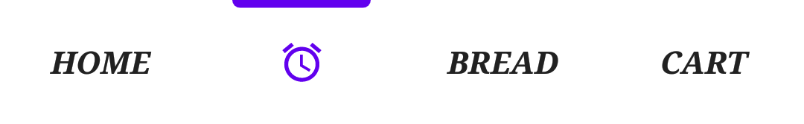
        </td>
        <td></td>
    </tr>
    <tr>
        <td><b>abb_rippleEnabled</b></td>
        <td>Enables the 'ripple' effect when selecting a tab.<br><br>
            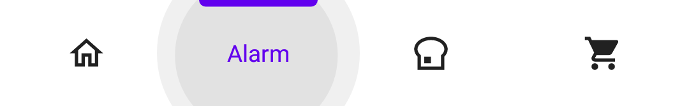</td>
        <td>false</td>
    </tr>
    <tr>
        <td><b>abb_rippleColor</b></td>
        <td>Change the color of the aforementioned ripple effect.</td>
        <td>Default theme color</td>
    </tr>
</table>

### Animations
<table>
    <tr>
        <th>Attribute</th>
        <th>Description</th>
        <th>Default</th>
    </tr>
    <tr>
        <td><b>abb_selectedTabType</b></td>
        <td>
            Determines whether the icon or text should be shown when a tab has been selected.<br><br>
            <b>icon</b><br>
            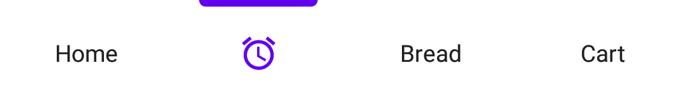<br>
            <b>text</b><br>
            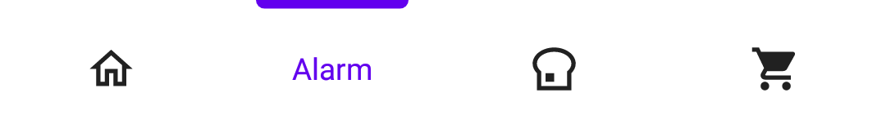<br>
        </td>
        <td>icon</td>
    </tr>
    <tr>
        <td><b>abb_tabAnimation</b></td>
        <td>
            The enter and exit animation style of the tabs which are not selected.<br><br>
            <b>none</b><br>
            <br>
            <b>slide</b><br>
            <br>
            <b>fade</b><br>
            <br>
        </td>
        <td>fade</td>
    </tr>
    <tr>
        <td><b>abb_tabAnimationSelected</b></td>
        <td>
            The enter and exit animation style of the selected tab.<br><br>
            <b>none</b><br>
            <br>
            <b>slide</b<br><br>
            <br>
            <b>fade</b><br>
            <br>
        </td>
        <td>slide</td>
    </tr>
    <tr>
        <td><b>abb_animationInterpolator</b></td>
        <td>
            The interpolator used for all animations.<br><br>See "<a href="https://thoughtbot.com/blog/android-interpolators-a-visual-guide">Android Interpolators: A Visual Guide</a>" for more information on available interpolators.<br><br>
            Example value: <i>@android:anim/overshoot_interpolator</i><br>
            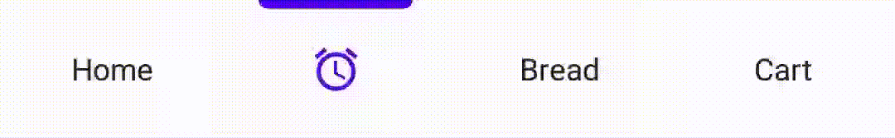
        </td>
        <td>FastOutSlowInInterpolator</td>
    </tr>
</table>

### Indicator
<table>
    <tr>
        <th>Attribute</th>
        <th>Description</th>
        <th>Default</th>
    </tr>
    <tr>
        <td><b>abb_indicatorColor</b></td>
        <td>The color of the indicator.</td>
        <td>@android/colorPrimary</td>
    </tr>
    <tr>
        <td><b>abb_indicatorHeight</b></td>
        <td>The height of the indicator.</td>
        <td>3dp</td>
    </tr>
    <tr>
        <td><b>abb_indicatorMargin</b></td>
        <td>The horizontal margin of the indicator. This determines the width of the indicator.</td>
        <td>0dp</td>
    </tr>
    <tr>
        <td><b>abb_indicatorAppearance</b></td>
        <td>
            Configure the shape of the indicator either to be square or round.<br><br>
            <b>invisible</b><br>
            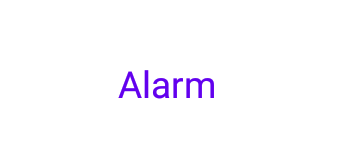<br>
            <b>square</b><br>
            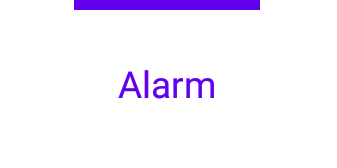<br>
            <b>round</b><br>
            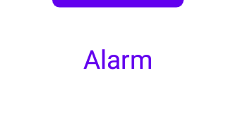<br>
        </td>
        <td>square</td>
    </tr>
    <tr>
        <td><b>abb_indicatorLocation</b></td>
        <td>
            Configure the location of the selected tab indicator, top, bottom or invisible.<br><br>
            <b>top</b><br>
            <br>
            <b>bottom</b><br>
            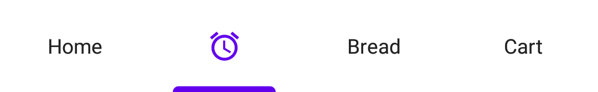<br>
        </td>
        <td>top</td>
    </tr>
    <tr>
        <td><b>abb_indicatorAnimation</b></td>
        <td>
            The animation type of the indicator when changing the selected tab.<br><br>
            <b>none</b><br>
            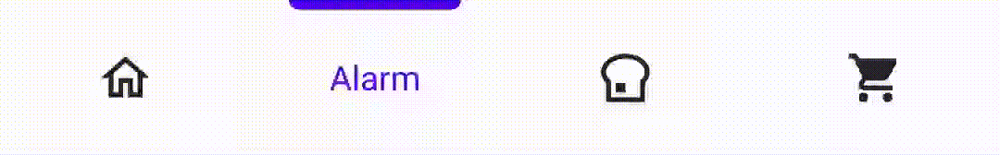<br><br>
            <b>slide</b><br>
            <br>
            <b>fade</b><br>
            
        </td>
        <td>slide</td>
    </tr>
</table>

## Credits
- https://dribbble.com/shots/6130593-Readable-Tab-Bar<br>For the awesome concept :)
- https://github.com/iammert/ReadableBottomBar<br>Awesome library, but it was lacking the configurability I needed for my own project.

## License
```
MIT License

Copyright (c) 2020 Joery Doppers (https://github.com/Droppers)

Permission is hereby granted, free of charge, to any person obtaining a copy
of this software and associated documentation files (the "Software"), to deal
in the Software without restriction, including without limitation the rights
to use, copy, modify, merge, publish, distribute, sublicense, and/or sell
copies of the Software, and to permit persons to whom the Software is
furnished to do so, subject to the following conditions:

The above copyright notice and this permission notice shall be included in all
copies or substantial portions of the Software.

THE SOFTWARE IS PROVIDED "AS IS", WITHOUT WARRANTY OF ANY KIND, EXPRESS OR
IMPLIED, INCLUDING BUT NOT LIMITED TO THE WARRANTIES OF MERCHANTABILITY,
FITNESS FOR A PARTICULAR PURPOSE AND NONINFRINGEMENT. IN NO EVENT SHALL THE
AUTHORS OR COPYRIGHT HOLDERS BE LIABLE FOR ANY CLAIM, DAMAGES OR OTHER
LIABILITY, WHETHER IN AN ACTION OF CONTRACT, TORT OR OTHERWISE, ARISING FROM,
OUT OF OR IN CONNECTION WITH THE SOFTWARE OR THE USE OR OTHER DEALINGS IN THE
SOFTWARE.
```
